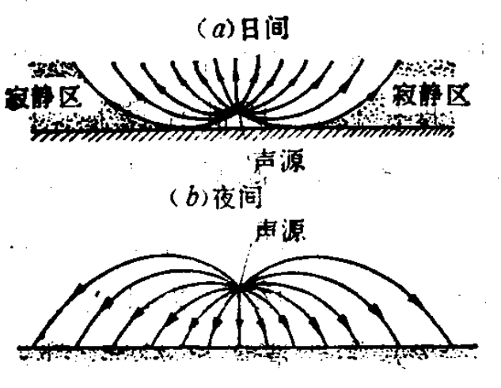

# 声音

[TOC]

## 声源

一切能发出声音的物体都叫”声源“。

声源的发声都是物体做机械振动的结果。

声音的传播必须有空气等能传播机械振动的弹性介质。称它们为传声“媒质”。

## 声波

### 纵波

振动方向与波的传播方向相同的波。

液体和气体只能传播纵波。

### 横波

振动方向与传播方向互相垂直的波。

横波只能发生在固体中。

## 声速

### 在空气中（标准大气压，即 101.325 帕）

| 温度（℃） | 声速（m/s） |
| --------- | ----------- |
| -150      | 217         |
| -30       | 313         |
| -20       | 319         |
| -10       | 325         |
| 0         | 330         |
| 10        | 338         |
| 15        | 340         |
| 20        | 344         |
| 30        | 349         |
| 50        | 360         |
| 100       | 386         |
| 300       | 478         |
| 500       | 553         |
| 700       | 622         |
| 1000      | 700         |

### 在气体和蒸汽中（0℃时）

| 媒质             | 声速（m/s） |
| ---------------- | ----------- |
| 溴蒸汽           | 135         |
| 乙醚蒸汽         | 181         |
| 水银蒸汽（300℃） | 187         |
| 二硫化碳蒸汽     | 195         |
| 氯气             | 206         |
| 酒精蒸汽         | 231         |
| 二氧化碳         | 260         |
| 氩气             | 308         |
| 氧气             | 316         |
| 一氧化碳         | 337         |
| 氮气             | 338         |
| 水蒸气           | 400         |
| 照明用煤气       | 500         |
| 氦气             | 971         |
| 氢气             | 1262        |

### 在固体和液体中（常温时）

| 媒质     | 声速（m/s） |
| -------- | ----------- |
| 软木     | 430 ~ 530   |
| 乙醚     | 1030        |
| 酒精     | 1275        |
| 铅       | 1300        |
| 水       | 1450        |
| 海水     | 1510        |
| 硬橡胶   | 1570        |
| 金       | 1743        |
| 冰（0℃） | 3160        |
| 松木     | 3320        |
| 砖       | 3650        |
| 铜       | 3800        |
| 钢，铁   | 4900 ~ 5000 |
| 玻璃     | 5000 ~ 6000 |

## 声波特性

### 反射

当声波的波长比障碍物的尺寸小得多的时候，就会产生反射。

#### 混响

当声源发声以后，声音在一个封闭空间内的多次无规反射、逐渐衰减的现象称之为“混响”。

声源发声后，声强衰减为原来的百万分之一所需要的时间，称之为“混响时间”，以 T60 表示。

声音会因为反射声与原来的声音的混杂而变得含混不清。混响时间过长，会使声音含糊不清；混响时间过段，会使声音显得干枯、单调。

实践证明，对听音乐的厅堂混响时间控制在 1~2 秒间较合适。

混响时间与房屋的关系公式，首先是由物理学家赛宾（N.C.Sabine）在 1900 年提出的：
$$
\Huge T_{60} \approx \frac{KV}{A}  \\
\\
\Huge A = \bar{\alpha } S
$$

* T60      闭室的混响时间。              s
* V         闭室的容积。                      m3
* A         室内总吸声量。
* K         与空气温度有关的一个常量，常温下约为 0.16 s / m
* 墙壁、天花板、地板、房间内表面的吸声系数的平均值，它没有量纲。
* S          闭室内表面总面积。

混响时间与房间容积及内表面吸声量有关。

### 折射

由于大气温度是不均匀的，声波也会发生折射现象。

白天因地面受太阳照射，空气温度随高度上升而降低，声速也因此减小，声波发生向上“弯射”，从而造成白天声音的传播距离减小。相反，夜间空气温度随高度而增加，声波发生向下“弯射”，因而可以传播得很远。

 

上图 a 中向上弯射的声波，上升到一定高度时，由于空气强烈吸收紫外线辐射，温度升高，故又引起声音向下弯射。因此在发生强烈声音时，在声源附近有一地区可直接听到声音，再向外出现一个寂静区，听不到声音。但在寂静区的外围又会出现一个异常可闻区。

### 绕射

当声音遇到的障碍物尺寸与声波的波长相近时，声波将不发生反射，而是绕过障碍物继续传播，这是声波的绕射现象。

### 叠加

从几个波源产生的波在同一介质中传播时，无论相遇与否，都保持自己原有的特性（频率、波长、振动方向等），并按照自己原来的传播方向继续前进，不受其他波的影响。因此，在相遇处各质点的位移是各波单独存在时在该点所引起的位移的矢量和，这就是波的叠加原理。

### 干涉

### 驻波

