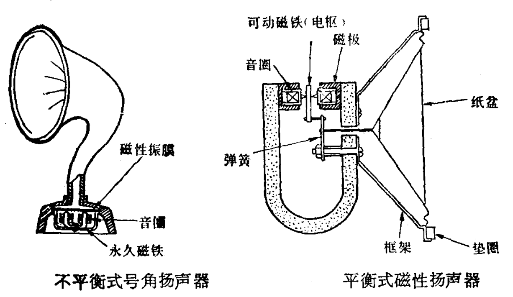
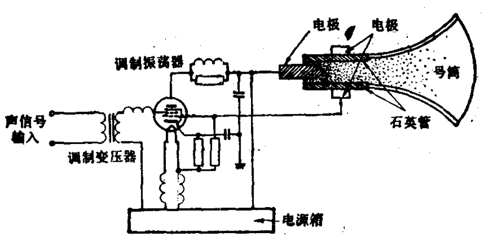

# 扬声器 Speaker
符号：B或BL
## 分类
| 分类方法    | 名称                          |
|------------|------------------------------|
| 外形尺寸    | 微型扬声器，中型扬声器，大型扬声器 |
| 换能方式    | 电动式、电磁式、压电式、气动式、静电式、离子放电式 |
| 声音频带范围 | 全频带，低音，中音，高音         |
| 振膜形状    | 锥盆式，球顶式，平板式           |

### 电磁式（舌簧式）

 

当信号电流流过音圈时，使小铁片（磁性振膜）发生磁化，从而和磁极间产生吸引或推斥作用，带动膜片振动而发声。

后改进为舌簧扬声器。以纸盆代替了金属膜片，而且改为直接辐射形式，因此音质有了较明显的改善。但其频率响应范围仍只限于 200 ~ 3000 Hz 左右，功率也较小，一般在 0.2 W 以下。

### 电动式（动圈式）

1925 年，美国通用公司的 Chester Rice 和 Edward kerrog 发明了电动式扬声器。

### 离子放电式

主要用在高频单元设计中。音质纯净通透，能精确地重现最高的音高，失真很低，有最佳的瞬态响应特性。

 

### 静电式（电容式）

### 气动式（压缩空气活门式）

### 压电式

